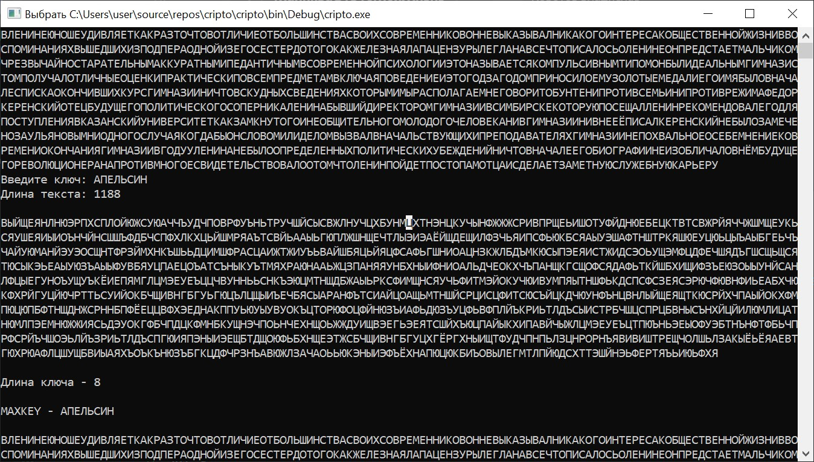

# Vigenere
# Шифр Виженера
**Шифр Виженера**  это метод шифрования буквенного текста с использованием ключевого слова.

Этот метод является простой формой многоалфавитной замены. Шифр Виженера изобретался многократно. Впервые этот метод описал Джованни-Баттиста Беллазо (Giovan Battista Bellaso) в книге La cifra del. Sig. Giovan Battista Bellasо в 1553 году , однако в 19 веке получил имя Блеза Виженера , швейцарского дипломата. Метод прост для понимания и реализации, он является недоступным для простых методов криптоанализа.
В  [шифре Цезаря](https://ru.wikipedia.org/wiki/%D0%A8%D0%B8%D1%84%D1%80_%D0%A6%D0%B5%D0%B7%D0%B0%D1%80%D1%8F "Шифр Цезаря")  каждая буква алфавита сдвигается на несколько позиций; например в шифре Цезаря при сдвиге +3, A стало бы D, B стало бы E и так далее. Шифр Виженера состоит из последовательности нескольких шифров Цезаря с различными значениями сдвига. Для зашифровывания может использоваться таблица алфавитов, называемая tabula recta или квадрат (таблица) Виженера. Применительно к латинскому алфавиту таблица Виженера составляется из строк по 26 символов, причём каждая следующая строка сдвигается на несколько позиций. Таким образом, в таблице получается 26 различных шифров Цезаря. На каждом этапе шифрования используются различные алфавиты, выбираемые в зависимости от символа ключевого слова. Например, предположим, что исходный текст имеет такой вид:

```ATTACKATDAWN```

Человек, посылающий сообщение, записывает ключевое слово («LEMON») циклически до тех пор, пока его длина не будет соответствовать длине исходного текста:

```LEMONLEMONLE```

Первый символ исходного текста ("A") зашифрован последовательностью L, которая является первым символом ключа. Первый символ зашифрованного текста ("L") находится на пересечении строки L и столбца A в таблице Виженера. Точно так же для второго символа исходного текста используется второй символ ключа; то есть второй символ зашифрованного текста ("X") получается на пересечении строки E и столбца T. Остальная часть исходного текста шифруется подобным способом.

Исходный текст:          ```ATTACKATDAWN```
Ключ:              ```   LEMONLEMONLE```
Зашифрованный текст: ``` LXFOPVEFRNHR```

Расшифровывание производится следующим образом: находим в таблице Виженера строку, соответствующую первому символу ключевого слова; в данной строке находим первый символ зашифрованного текста. Столбец, в котором находится данный символ, соответствует первому символу исходного текста. Следующие символы зашифрованного текста расшифровываются подобным образом.

В компьютере такая операция соответствует сложению кодов ASCII символов сообщения и ключа по некоторому модулю. Кажется, что если таблица будет более сложной, чем циклическое смещение строк, то шифр станет надежнее. Это действительно так, если ее менять чаще, например, от слова к слову. Но составление таких таблиц, представляющих собой латинские квадраты, где любая буква встречается в строке или столбце один раз, трудоемко и его стоит делать лишь на ЭВМ. Для ручного же многоалфавитного шифра полагаются лишь на длину и сложность ключа, используя приведенную таблицу, которую можно не держать в тайне, а это упрощает шифрование и расшифровывание.
# Индекс совпадений
**Индекс совпадений** — один из методов  [криптоанализа](https://ru.wikipedia.org/wiki/%D0%9A%D1%80%D0%B8%D0%BF%D1%82%D0%BE%D0%B0%D0%BD%D0%B0%D0%BB%D0%B8%D0%B7 "Криптоанализ")  [шифра Виженера](https://ru.wikipedia.org/wiki/%D0%A8%D0%B8%D1%84%D1%80_%D0%92%D0%B8%D0%B6%D0%B5%D0%BD%D0%B5%D1%80%D0%B0 "Шифр Виженера"). Описание было опубликовано  [Уильямом Фридманом](https://ru.wikipedia.org/wiki/%D0%A4%D1%80%D0%B8%D0%B4%D0%BC%D0%B0%D0%BD,_%D0%A3%D0%B8%D0%BB%D1%8C%D1%8F%D0%BC_%D0%A4%D1%80%D0%B5%D0%B4%D0%B5%D1%80%D0%B8%D0%BA "Фридман, Уильям Фредерик")  в 1920 году.

Метод основывается на вычислении вероятности того, что два случайных элемента текста совпадут. Эту вероятность называют индексом совпадений. Уильям Фридман показал, что значения индекса совпадений существенно отличаются для текстов различной природы. Это позволяет сначала определить длину ключа шифра, а затем найти и сам ключ.

Появление метода индекса совпадений открыло новые возможности в криптоанализе шифра Виженера. По сравнению с распространённым в то время  [методом Касиски](https://ru.wikipedia.org/wiki/%D0%9C%D0%B5%D1%82%D0%BE%D0%B4_%D0%9A%D0%B0%D1%81%D0%B8%D1%81%D0%BA%D0%B8 "Метод Касиски"), новый метод был менее трудоёмким, требовал меньшей длины текста, был более пригоден для автоматизации и менее подвержен ошибкам. Индекс совпадений являлся более эффективным и допускал анализ шифров с длинными ключами.
Для поиска индекса совпадений используем следующую формулу:

После того, как узнали длину
# Криптоанализ 
**Шифр Виженера** достаточно безопасен: в качестве ключа в нем используется слово и его сложно взломать вручную с помощью одного только частотного анализа или перебора. Каждая буква ключа генерирует число, и в результате мы получаем несколько несколько ключей для сдвига букв.
После того, как узнали длину ключа, можно легко найти сам ключ.
Например, предполагаемая длина ключа 7. Мы начинаем с начального ключа, который может быть выбран произвольно, или просто 7 'A, например: ``` «ААААААА».``` Мы называем это «родительским» ключом. Далее перебираются все варианты букв от А до Я в качестве первой буквы, например: ``` «ААААААА», «БАААААА», «ВАААААА», ... ```Они называются  «дочерними» ключами. Если какой-либо из 33 дочерних ключей имеет более высокое соответствие, чем родительский, то родительским ключом становится ключ с наибольшим соответствием. Если ```«ДААААА»```оказался дочерним ключом с наибольшей оценкой, он становится родительским. Теперь мы переходим ко второму столбцу и пробуем все возможности ```«ДАААААА», «ДБААААА», «ДВААААА», ... ``` Родитель снова устанавливается на лучшего потомка. Эта процедура повторяется для всех ключевых букв. Как только будет достигнута 7-я буква, повторяем ту же самую процедуру, но каждый раз будет отталкиваться от лучшего ключа. В итоге получим ключ, с помощью которого можно расшифровать текст.
# Скриншоты результатов



# Заключение
Алгоритм работает не всегда, т.к. является эвристическим, поэтому иногда может получиться так, что ключ будет найдет неверно. Однако, в большинстве случаев алгоритм будет работать верно. Также вероятность нахождения ключа будет зависеть от длины текста: чем текст длиннее, тем точнее будет рассчитываться значение соответствия текста.
